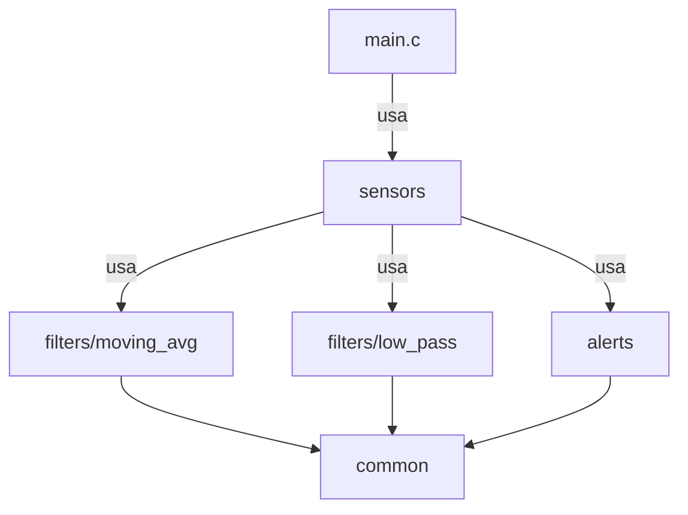

<h1 align="center">🚗 ECU Sensor Monitor</h1>

<p align="center">
  <em>Sistema modular de monitoramento de sensores automotivos com conformidade MISRA-C.</em>
</p>

<p align="center">
  
  
  
  
  
</p>

---

## 📖 Sobre o Projeto

Sistema embarcado para monitoramento de sensores automotivos em tempo real com arquitetura modular e filtros digitais (DSP).

- 🏗️ **Arquitetura Modular** - Separação clara entre módulos (Common, Filters, Alerts, Sensors)
- 📊 **Filtros Digitais** - Média móvel (FIR) e passa-baixa (IIR) otimizados
- 🔒 **MISRA-C:2012** - Código seguro para aplicações críticas
- ⚡ **Real-Time** - Processamento a 100 Hz, sem alocação dinâmica

> **✅ Status:** Funcional com sensores de Temperatura, Pressão de Óleo e RPM. Pronto para hardware real (Arduino/STM32).

---

## ✨ Tecnologias

<details>
  <summary><strong>Core</strong></summary>
  
- **C99** - Linguagem padrão para sistemas embarcados
- **DSP** - Filtros FIR e IIR
- **O(1)** - Algoritmos com tempo constante
</details>

<details>
  <summary><strong>Arquitetura</strong></summary>

- **Modular Design** - 5 módulos independentes
- **MISRA-C:2012** - Padrões automotivos
- **Low Coupling** - Dependências unidirecionais
- **Defensive Programming** - Validação de ponteiros
</details>

---

## 🏛️ Arquitetura



**Camadas:**
- **Aplicação** → main.c
- **Gerenciamento** → sensors/
- **Processamento** → filters/, alerts/
- **Fundação** → common/

---

## 🚀 Como Executar

### Pré-requisitos

- GCC 7+ ou Clang 10+
- GNU Make

**Instalar (Ubuntu/Debian):**
```bash
sudo apt-get install build-essential
```

### Compilar e Executar

```bash
git clone https://github.com/lucasmarques594/ecu_modular.git
cd ecu_modular
make
./bin/ecu_monitor
```

Ou simplesmente:
```bash
make run
```

---

## 💻 Uso

**Saída do programa:**

```
Tempo:   5.00 s
-----------------------------------------------------------------
Temperatura Motor    | Raw:   85.30 | MA:   84.50 | LP:   84.80 | Status: OK      
Pressão de Óleo      | Raw:    2.15 | MA:    2.20 | LP:    2.18 | Status: OK      
RPM Motor            | Raw: 2650.40 | MA: 2648.10 | LP: 2649.30 | Status: OK      

⚠️  ALERTA: Temperatura WARNING! (96.2°C)
```

**Configurar parâmetros:**

Edite `include/common/config.h`:
```c
#define SAMPLE_RATE_HZ      100U    // Taxa de amostragem
#define MOVING_AVG_WINDOW   10U     // Janela do filtro
#define LOW_PASS_ALPHA      0.2f    // Coeficiente IIR
#define TEMP_WARNING        95      // Limite de alerta
```

---

## 📁 Estrutura

```
ecu_modular/
├── include/
│   ├── common/         # Tipos e configurações
│   ├── filters/        # APIs dos filtros
│   ├── alerts/         # API de alertas
│   └── sensors/        # API de sensores
├── src/
│   ├── filters/        # Implementação FIR/IIR
│   ├── alerts/         # Implementação debounce
│   ├── sensors/        # Gerenciamento
│   └── main.c
└── Makefile
```

**Módulos:**
- **common** → Tipos e config
- **filters** → DSP (média móvel, passa-baixa)
- **alerts** → Detecção com debounce
- **sensors** → Integração de alto nível

---

## 🛠️ Comandos

```bash
make        # Compilar
make run    # Compilar e executar
make clean  # Limpar build
make debug  # Build com debug
make info   # Informações
```

---

## 🎓 O Que Demonstra

✅ Filtros digitais (FIR/IIR)  
✅ Processamento real-time (100 Hz)  
✅ Arquitetura modular  
✅ MISRA-C:2012  
✅ Sem alocação dinâmica  
✅ Código testável  

---

## 🚀 Hardware Real

**Arduino:** Substitua simulador por `analogRead()`  
**STM32:** Use timers + DMA  
**ESP32:** Configure com FreeRTOS  

---

<h3 align="center">Feito com ❤️ por <a href="https://github.com/lucasmarques594">Lucas Marques</a></h3>